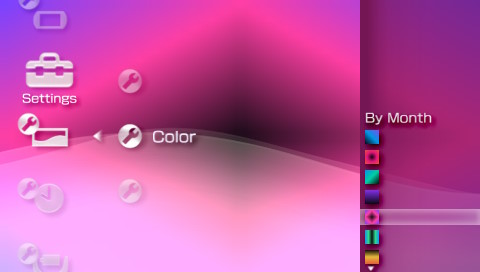
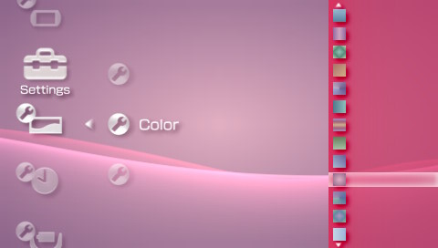
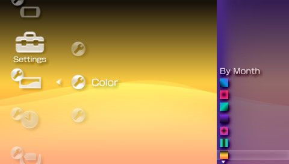
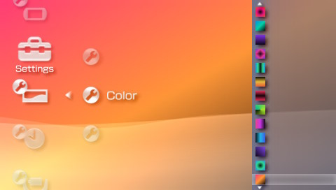
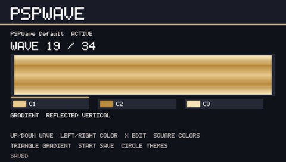
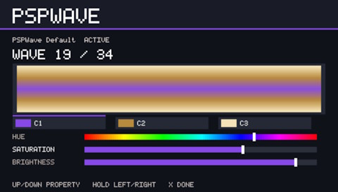
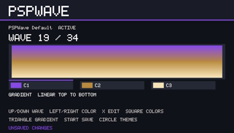
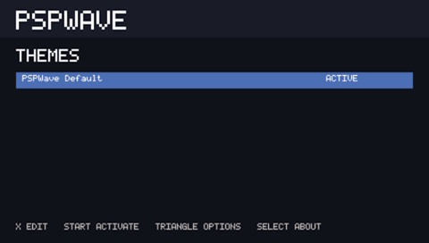
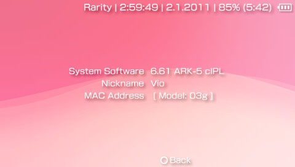
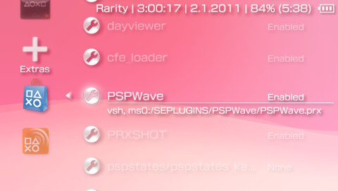

# PSPWave


[](https://github.com/violinmelody/PSPWave/actions/workflows/build_editor.yml) [](https://github.com/violinmelody/PSPWave/actions/workflows/build_plugin.yml) [](https://github.com/violinmelody/PSPWave/actions/workflows/smoketest.yml)


### Custom PSP XMB Wave Editor & Generator

PSPWave lets you create custom XMB wave backgrounds & update sidebar colours for the
PlayStation Portable and PS Vita Adrenaline. Edit and preview it directly on the PSP - no need to manually edit txt files or use any external tools or websites.

Create:
- custom XMB wave colors
- 1-3 colour gradients
- horizontal and diagonal, radial, angle, reflected and diamond gradients
- custom 60×34 BMP colour maps
- custom XMB wave presets (themes)
- custom XMB sidebar colours

### [> Download <](https://github.com/violinmelody/PSPWave/releases)

**Version:** 1.1.0<br/>
**Author:** Miss Violin Melody<br/>
**Website:** https://violinmelody.net<br/>

 <br/>
 


### Compatibility

- PSP - 6.61 ARK-5
- PS Vita - 6.61 Adrenaline


### PSPWave vs wavezbg

PSPWave is a modern alternative to wavezbg with a built-in PSP editor,
advanced gradient modes, themes management, custom image-based
wave backgrounds & option to change sidebar menu colours

| Feature | 🎨 **PSPWave** | 🌊 **wavezbg** |
|---|:---:|:---:|
| On-device editor | ✅ | ❌ |
| Live preview | ✅ | ❌ |
| Advanced gradients | ✅ | ❌ |
| HSV editing | ✅ | ❌ |
| HTML HEX colours | ✅ | ✅ |
| BMP import | ✅ | ❌ |
| Multiple Theme sets support | ✅ | ❌ |
| HSV editing | ✅ | ❌ |
| Web editor | ❌ | ✅ |
| Option to edit .txt file manually | ✅ | ✅ |
| PSP 6.61 ARK-5 support | ✅ | ✅ |
| PSVita 6.61 Adrenaline support | ✅ | ✅ |
| Non-destructive working model | ✅ | ✅ |
| Lightweight | ✅ | ✅ |
| License | MIT | GPL-3.0 |

> [!NOTE]
> This project is not affiliated with or endorsed by Sony. [PSPDEV/PSPSDK](https://github.com/pspdev/pspsdk) is the open-source SDK/toolchain used to build this program & plugin.


## Table of contents
> - [How it works](#how-it-works)
>   - [Supported modes](#supported-modes)
>   - [Editor](#live-preview)
>   - [Themes](#theme-sets)
>   - [Controls](#controls)
>
> - [Installation](#installation)
>   - [First start](#first-start)
>
> - [Working with repository](#working-with-repository)
>   - [Prerequisites](#prerequisites)
>   - [Clone the repository](#clone-the-repository)
>   - [Build editor](#build-editor-ebootpbp)
>   - [Build plugin](#build-plugin-pspwaveprx)
>
> - [License](#license)


## How it works
PSPWave exposes all 34 replacement background records used by the 6.61 firmware. Every wave stores one, two or three colours and its own gradient direction.


PSPWave ships with its own default palette & few alternative theme sets.

### Supported modes

PSPWave supports two modes - GRADIENT MODE & IMAGE MODE.

In GRADIENT MODE user can set colours and switch between following gradients:
- Linear Left to Right
- Linear Right to Left
- Linear Top to Bottom
- Linear Bottom to Top
- Linear Top Left to Bottom Right
- Linear Top Right to Bottom Left
- Radial
- Angle
- Reflected Horizontal
- Reflected Vertical
- Diamond

In IMAGE MODE user can select a 24bit BMP image that will be converted to XMB background for selected wave.

> [!NOTE]
> Image mode is experimental. Unfortunately PSP supports only 60x34 images for XMB backgrounds - using any image of higher resolution will result in blurry background.
> Use this mode only when you want to load custom made gradients & colour maps made in external image editor. This allows for even more freedom.

### Editor



The PSPWave editor renders a live preview using the same gradient & colour sampling implementation used to generate the XMB resource packs.

 

Changes to colours, colour count, HSV values and gradient mode are therefore visible immediately before saving.

### Themes



PSPWave supports multiple named wave sets. Theme files are stored in `ms0:/SEPLUGINS/PSPWave/Themes/`. The Themes screen lets you create, duplicate, rename, delete, edit and activate sets. The editor always shows the set name and whether it is ACTIVE.

Activating a set serializes that set into `PSPWave.txt` and rebuilds necessary files. Editing a non-active set only changes its own theme file, editing the active set and saving also refreshes the active plugin resources.

### Controls

- Up / Down: select wave
- Left / Right: select colour
- X: edit selected colour
- Square: cycle 1 / 2 / 3 colours
- Triangle: cycle gradient direction
- In colour editor, Up / Down: select Hue, Saturation, Brightness
- In colour editor, hold Left / Right: adjust selected component
- START: save configuration and rebuild resource packs
- Circle: exit


## Installation



> [!CAUTION]
> Make sure you are installing it on [PSP running CFW 6.61 ARK-5](https://github.com/PSP-Arkfive/ARK-5) or [PSVita running CFW 6.61 Adrenaline](https://github.com/TheOfficialFloW/Adrenaline)
> Do not attempt to run it on older CFW or OFW.

Copy the `PSPWave.prx` & `/Themes/` folder to:

```
ms0:/SEPLUGINS/PSPWave/
    PSPWave.prx
    /Themes/...
```

Copy the `/PSPWave/EBOOT.PBP` to:

```
ms0:/PSP/GAME/PSPWave/EBOOT.PBP
```

Register the plugin in `ms0:/SEPLUGINS/PLUGINS.TXT`:

```
vsh, ms0:/SEPLUGINS/PSPWave/PSPWave.prx, on
```

### First start



Check if the PSPWave is enabled in the Extras > Plugins. After that start the `/PSPWave/EBOOT.PBP`.

On first run, the EBOOT creates necessary files in the PSPWave plugin directory. A restart of the VSH/PSP after saving might be needed so the VSH reloads the replacement resources.


## Working with repository

If you are interested in working with this codebase and compiling it locally, below you will find detailed instructions.


### Prerequisites

Install [PSPDEV/PSPSDK](https://github.com/pspdev/pspsdk). The official Docker image is also supported: https://pspdev.github.io/installation/docker.html

For a local installation, `PSPDEV` and `PSPSDK` must be exported and the PSP toolchain must be on `PATH`, e.g.:

```sh
export PSPDEV=/opt/pspdev
export PSPSDK="$PSPDEV/psp/sdk"
export PATH="$PATH:$PSPDEV/bin:$PSPDEV/psp/bin"
```


### Clone the repository

Install Git then clone the repository and enter its directory:

```sh
git clone https://github.com/violinmelody/PSPWave
cd PSPWave
```


### Build editor (EBOOT.PBP)

```sh
export PSPDEV=/path/to/pspdev
export PSPSDK="$PSPDEV/psp/sdk"
export PATH="$PSPDEV/bin:$PATH"
make clean
make -j$(nproc)
```

### Build plugin (PSPWave.prx)

```sh
cd plugin
psp-cmake -S . -B build
cmake --build build
```


## License

The source code is shared under the MIT license - see [LICENSE](./LICENSE).

THE SOFTWARE IS PROVIDED “AS IS” AND THE AUTHOR DISCLAIMS ALL WARRANTIES WITH REGARD TO THIS SOFTWARE INCLUDING ALL IMPLIED WARRANTIES OF MERCHANTABILITY AND FITNESS. IN NO EVENT SHALL THE AUTHOR BE LIABLE FOR ANY SPECIAL, DIRECT, INDIRECT, OR CONSEQUENTIAL DAMAGES OR ANY DAMAGES WHATSOEVER RESULTING FROM LOSS OF USE, DATA OR PROFITS, WHETHER IN AN ACTION OF CONTRACT, NEGLIGENCE OR OTHER TORTIOUS ACTION, ARISING OUT OF OR IN CONNECTION WITH THE USE OR PERFORMANCE OF THIS SOFTWARE.

